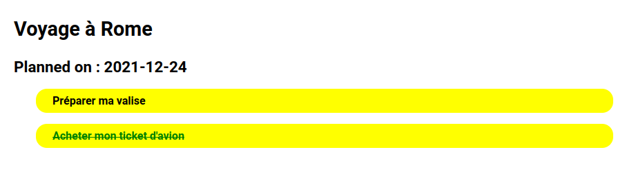

# TRIP REMINDER

## Variables d'environnement utilisées par les services Docker

Fichiers à créer à la racine du répertoire principal et à compléter sur la base des fichiers fournis en exemple :

- .env.strapi
- .env.mariadb

## Strapi (CMS Headless)

- Back Office : http://localhost:1337/admin/
- Front Office : http://localhost:1337/admin/

### API Rest

#### Endpoints

- Sign Up : http://localhost:1337/auth/local/register

Requête POST

Body au format JSON

```
{
    "username":"Peter White",
    "email":"peter@white.com",
    "password":"Azerty123"
}
```

- Sign In : http://localhost:1337/auth/local

Requête POST

Body au format JSON
```
{
    "identifier":"peter@white.com",
    "password":"Azerty123"
}
```

- Actions de type CRUD (Create Read Update Delete) :

- http://localhost:1337/trips
- http://localhost:1337/notes
- http://localhost:1337/users

Si l'accès aux données est réservé aux utilisateurs connectés, renseigner le token JWT obtenu après un sign in ou sign up réussi

#### Gestion de l'accès à l'API et des actions autorisées sur les ressources

Pour gérer l'accès aux collections de données

http://localhost:1337/admin/settings/users-permissions/roles

Paramètres / Users & permissions plugin / Rôles & permissions

- Authenticated = utilisateur connecté
- Public = accès sans connexion préalable

Encadré Permissions / Bloc Application

Sélectionner la collection et attribuer les droits pour chaque action que vous souhaitez autoriser

## Client web React.js

http://localhost:3000

Le client web consomme l'API Rest fournie par Strapi.

Pour que le client web accède aux données exposées par l'API, les règles d'accès doivent être ajustées (cf. Gestion de l'accès à l'API et des actions autorisées sur les ressources).

- Installer les dépendances du projet avec la commande `yarn` ou `npm install` (depuis la racine du projet React.js "./trip_reminder_web_app").

- Démarrer le projet (après avoir lancé les services Docker) : `yarn start`



## Adminer

http://localhost:8181

- Serveur : trip_mariadb
- Utilisateur : cf. variables d'environnement
- Mdp : cf. variables d'environnement
- BDD : cf. variables d'environnement

Des données d'exemple peuvent être importées dans la base de données Mariadb depuis Adminer (./example_data.sql).

## Commandes Docker Compose

- Initialisation des services
```
docker-compose up
```

ou

```
docker-compose up -d
```

- Fermer les services

```
docker-compose stop
```

- Ré-initialiser les services

```
docker-compose down
```

ou

Raccourci clavier CTRL + C

---

**Alexandre Leroux**

- _Mail_ : alex@sherpa.one
- _Github_ : sherpa1
- _Twitter_ : @_sherpa_
- _Discord_ : sherpa#3890

_Enseignant vacataire à l'Université de Lorraine_

- IUT Nancy-Charlemagne (LP Ciasie)

- Institut des Sciences du Digital, Management & Cognition (Masters Sciences Cognitives)
